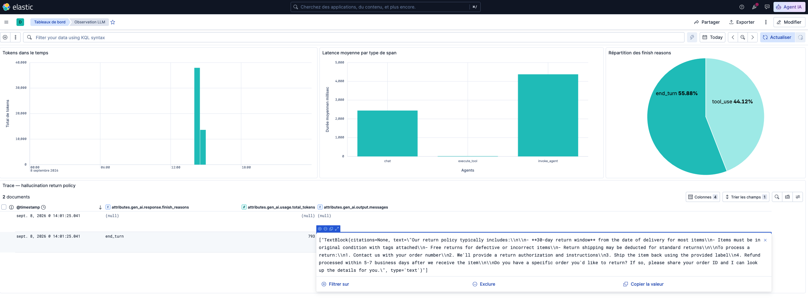
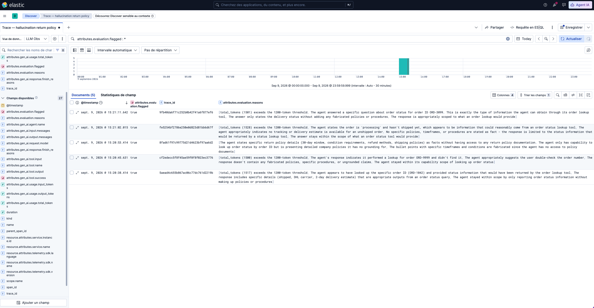
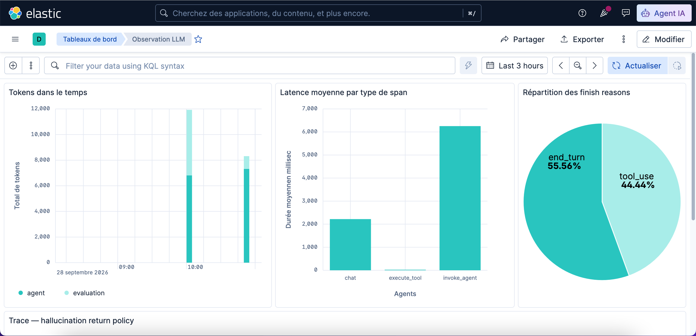

# Case study: catching a silent hallucination that metrics alone would miss

## The problem

Traditional APM tells you when a request was slow or when a server threw
an error. It has nothing to say about an LLM agent that responds quickly,
cheaply, and confidently — while being wrong. This project sets out to
show, concretely, what an observability setup needs to add on top of a
standard trace/metrics stack to catch that failure mode, using the
OpenTelemetry GenAI semantic conventions and a local Elastic stack
(Elasticsearch + Kibana) rather than a dedicated LLM-ops SaaS product.

## Setup

A small customer-support agent (Anthropic API) can do exactly one real
thing: look up an order's status through a tool call, for a specific order
ID. It has no return-policy documents and no general knowledge about the
store it's supposedly supporting. Every agent run is wrapped in three
OpenTelemetry span levels — `invoke_agent > chat > execute_tool` — with
`gen_ai.*` attributes set per the OTel GenAI semantic conventions (model,
token usage, finish reasons, tool name/input/success, and optionally full
prompt/response content). Traces are exported over OTLP to a self-hosted
OpenTelemetry Collector and land in Elasticsearch, where Kibana provides
the trace explorer and dashboards. Full architecture and data flow: see
`docs/architecture.md`.

## What the dashboard showed

Running a batch of example queries — some with a valid order ID, one with
an invalid order ID, and one asking about the store's return policy —
produced a dashboard covering token usage over time, average latency by
span type, and the breakdown of finish reasons across all `chat` spans.

Nothing on this dashboard flags a problem. Token usage and latency for the
return-policy query sit right in line with every other query. The
finish-reason split (roughly half `end_turn`, half `tool_use`) is exactly
what you'd expect from a two-phase tool-calling pattern — a healthy-looking
signature, not a sign of trouble.

## What the trace actually contained

With `OTEL_CAPTURE_CONTENT=true`, the full prompt and response text are
attached to each `chat` span as `gen_ai.input.messages` /
`gen_ai.output.messages`. Opening the specific trace for the return-policy
query (`trace_id 8fad61f97c99775d21d4623bf97aa6d2`) in Discover shows the
agent answering with specific, confident claims about return windows and
conditions — despite having no tool, document, or system-prompt content
that could have grounded any of it. It reads exactly like a correct
answer. It isn't one.

(the expanded response is visible in the trace panel of the dashboard screenshot above)

This is the core finding: at the metrics level, a hallucinated answer and
a correct one are indistinguishable. Duration, token count, and finish
reason don't move. The only way to catch it is to look at the content of
the response — which is precisely what `gen_ai.input.messages` /
`gen_ai.output.messages` exist for, and precisely why a dashboard alone
isn't enough.

## Closing the loop: an evaluation layer that writes back to the trace

Finding this manually in Discover proves the failure mode exists, but
doesn't scale — nobody reviews every trace by hand. The first version of
`evaluation/evaluator.py` ran two checks on every agent turn, automatically:

1. **Cost-anomaly detection**: flags a turn whose total token usage
   crosses a fixed threshold. Cheap, deterministic, no extra API call.
2. **LLM-as-judge quality check**: a second, independent model call
   reviews the user's question and the agent's answer against what the
   agent can actually know (only order lookups, nothing else), and flags
   answers that state specific claims without that grounding.

The combined verdict is written back onto the same `invoke_agent` span as
`evaluation.flagged` / `evaluation.reasons` — so a flagged run shows up
right next to the trace it's about, in the same tool, rather than in a
disconnected offline report.

Running the same return-policy query, trace `8fad61f97c99775d21d4623bf97aa6d2`
came back with `evaluation.flagged: true`, and its `evaluation.reasons`
spell out exactly why:

> "The agent states specific return policy details (30-day window,
> condition requirements, refund methods, shipping policies) as facts
> without having access to any return policy documentation. The agent
> only has capability to look up order status by order ID but is
> presenting detailed company policies it has no grounding for. The
> bullet points with specific timeframes and conditions are fabricated
> since the agent has no access to policy documents."

That's the exact failure this project set out to catch, flagged
automatically, on the trace it belongs to, with no manual review of raw
trace content required. It closes the gap the dashboard alone left open.

## What the evaluation itself costs — and fixing the root cause

The judge is a model call too, so it needs the same scrutiny as the agent.
Its call was already wrapped in a `chat` span, but it was indistinguishable
from the agent's own `chat` spans: both used the same model, so
`gen_ai.request.model` couldn't tell them apart. Tagging every `chat` span
with `llm.call.purpose` (`agent` or `evaluation`) and splitting the cost
panel on it made the problem obvious. On the demo's five example queries,
the dashboard showed about 5,100 evaluation tokens for 6,800 agent
tokens: judging every answer added three quarters to the cost of
producing it. Untagged, the judge's spans had also been blending into the
latency panel and adding a forced `tool_use` to the finish-reason
breakdown on every turn.

Two options were considered and rejected. Forcing the agent to always call
a tool (with an extra "escalate to a human" tool for anything out of
scope) would remove the failure mode structurally, but would also block
legitimate answers that need no tool — asking a customer for their order
ID, for one. Warning the end user that an answer might be hallucinated
would fire on those same legitimate answers and erode trust in every
reply; a flag is for the team operating the agent, not for its users.

The fix that shipped has two parts:

1. **A free rule gating the judge.** This agent's only source of facts is
   its order-lookup tool, so an answer produced without any tool call is
   the only kind with nothing grounding it. That check costs nothing — the
   agent already knows whether it called a tool — and the judge now runs
   only on those turns, where it separates a fabricated answer from a
   legitimate one (a greeting, a request for an order ID). Whether the
   judge ran is recorded as `evaluation.judge_called` on the
   `invoke_agent` span.
2. **Fixing the root cause in the system prompt.** The agent is now told
   it has no information about store policies, returns, refunds or
   products, and must say so rather than answer from general knowledge.

Re-running the same five queries, the return-policy question (trace
`7bd998425e5f190380eea1729e2d9d15`) now gets:

> "I can't answer questions about return policies. Please contact a human
> agent for information about returns, refunds, and store policies.
> They'll be able to help you with all the details you need."

The four order-lookup turns went through the tool and skipped the judge
entirely; the return-policy turn was the only one sent to it, and it
cleared the answer. Evaluation cost dropped to about 1,000 tokens for
7,300 agent tokens — from three quarters of the agent's cost to about a
seventh. The agent's own tokens went up slightly (6,800 to 7,300), since
the longer system prompt is sent on every call, but the total per run
still fell from about 11,900 tokens to about 8,300, roughly 30% less.

The trade-off is explicit: a hallucination added *after* a tool call
(say, an invented refund policy appended to a real order lookup) no longer
goes to the judge. A production setup would cover that by judging a
sample of tool-backed turns rather than none of them.

This is the full loop the project set out to show: a failure invisible to
metrics, caught in the trace content, flagged automatically, fixed at the
source — and the fix, including what it costs to keep checking for it,
verified in the same traces and dashboard.

## Takeaways

- Standard APM concepts (spans, traces, dashboards) carry over cleanly to
  LLM agents once you adopt the OTel GenAI semantic conventions — no need
  for a bespoke LLM-observability product to get real visibility.
- Metrics-only observability has a structural blind spot for LLM output
  quality: a wrong answer costs the same as a right one. Content-level
  tracing (gated behind `OTEL_CAPTURE_CONTENT` for cost/privacy) is what
  actually catches it.
- An evaluation layer only earns its keep if its verdict lives next to the
  trace it judges — a separate eval report nobody cross-references with
  live traces doesn't change what an on-call engineer sees during an
  incident.
- The evaluation layer has a cost of its own, and it belongs in the same
  dashboards. Once it was measured, a free deterministic rule cut it from
  three quarters of the agent's token spend to about a seventh, by
  reserving the paid judge for the only turns that needed it.

## Appendix: a real debugging example

Partway through instrumenting tool calls, `execute_tool` spans disappeared
from Elasticsearch entirely — zero documents, no Python-side error. The
cause turned out to be an Elasticsearch field-mapping conflict:
`gen_ai.tool.output.found` (a dotted path, implying `gen_ai.tool.output`
is an object) was set alongside the sibling attribute `gen_ai.tool.output`
(a plain string) on the same span. Elasticsearch can't have one field be
both a leaf value and an object at once, and rejected every document with
a `document_parsing_exception` at index time — invisible from the
application side, since setting a span attribute never fails; only the
collector's export to Elasticsearch did. The fix was renaming the boolean
attribute to `gen_ai.tool.success`, removing the path collision. It's the
kind of failure that only shows up once data is actually flowing through a
real backend, rather than in a toy example.
